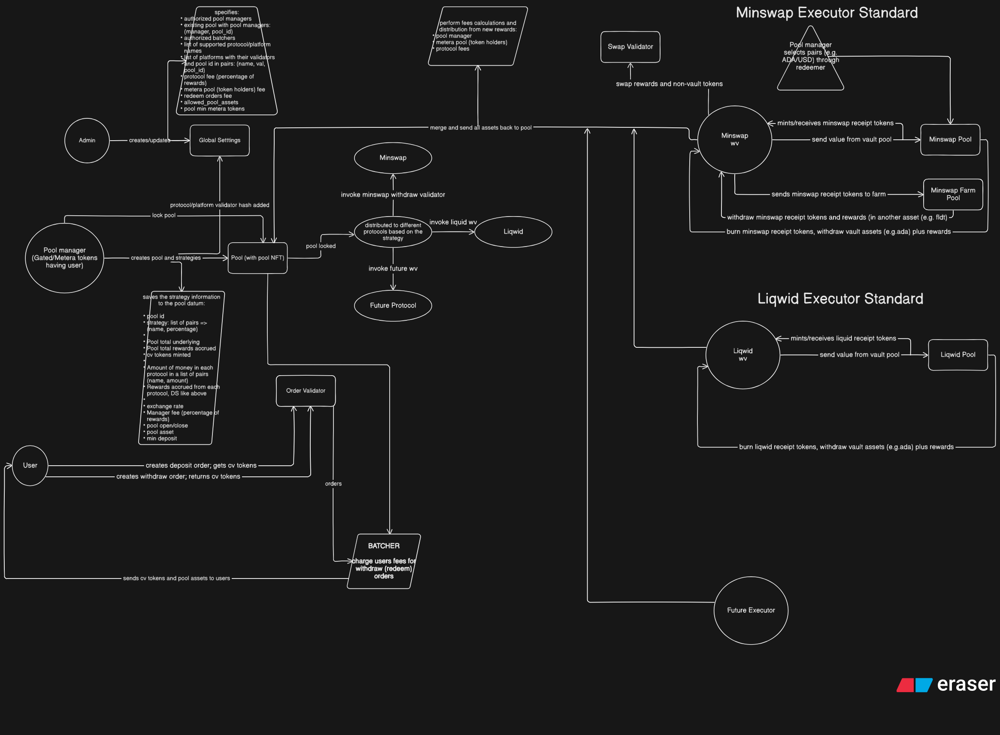

# Metera Cardano Vault Standard: Architecture

This document describes the intended Vault/Executor Standard, reusable Cardano infrastructure for independent managed strategy pools. It is under active development; the components and flows below are conceptual, not evidence of deployed or completed functionality. The standard is not production-ready, audited, or live on mainnet.

## Global Settings

Global Settings provide shared protocol-level configuration, such as approved scripts and executors, protocol parameters and governance-controlled configuration. They do not combine the assets or accounting of independent pools.

## Strategy Pool

Every strategy is represented by its own independent pool. There is no single global strategy pool. Each pool conceptually has:

- A unique Pool NFT identifying the pool.
- A canonical state UTxO carrying its pool datum/state.
- Strategy allocation configuration and current allocation state.
- Its own accounting and assets under management, including deployed positions.
- Its own share token supply.

The canonical state UTxO anchors pool state transitions; it does not imply that every asset or external position must physically reside in that UTxO. Pool identity, accounting and allocations must remain consistent across transitions.

## Pool Share Tokens

Users receive Cardano-native pool/share tokens representing proportional ownership in a specific strategy pool. Shares are generally minted when a deposit is processed and burned when a withdrawal is processed. Shares belong to that pool's accounting and are distinct from its identifying Pool NFT.

Exact accounting rules are still being designed, including how deployed positions and realised rewards affect share valuation.

## Order Validator

Deposits and withdrawals are represented by order UTxOs. A deposit order commits assets for a requested deposit; a withdrawal order commits shares for a requested redemption, subject to the eventual order rules.

This pattern lets users submit independent requests without each submission consuming the pool's canonical state UTxO. Processing an order subsequently coordinates the relevant pool transition and user outputs. The order validator is intended to enforce the conditions under which an order can be fulfilled or cancelled.

## Batcher

A batcher can collect multiple pending orders and construct transactions that coordinate pool state transitions, share minting or burning, and delivery of assets or shares to users. Batching can amortise state updates across several orders.

The batcher is a transaction coordinator, not an unrestricted custodian. On-chain validation must constrain how order and pool assets move, including the required user outputs. Off-chain components are expected to use TypeScript with Lucid and/or Mesh; the on-chain contracts are written in Aiken as implementation progresses.

## Executor Standard

The executor interface allows a pool to interact with external DeFi protocols without embedding protocol-specific implementation details into the core pool validator. Each executor is responsible for validating the rules for entering, managing and unwinding a specific protocol position.

The core pool logic should validate shared pool invariants and the use of approved, compatible executors. The executor supplies protocol-specific validation, including the expected movement of assets and representation of positions. This division is an intended validation boundary; the concrete interface has not yet been specified.

## Minswap Executor

Minswap is an initial reference target for a DEX/liquidity executor. A possible strategy flow is:

```text
Pool assets → Minswap executor → liquidity position / LP assets
            → optional farming or strategy action → unwind
            → assets and realised rewards returned to the pool
```

This is a conceptual flow, not a claim that liquidity provision, farming or reward handling has been implemented. Supported actions and their validation rules require specification and testing.

## Liqwid Executor

Liqwid is an initial reference target for a lending executor. A possible flow is:

```text
Pool assets → Liqwid executor → lending position / protocol representation
            → yield accrual → withdrawal / unwind
            → principal and realised yield returned to the pool
```

This flow expresses the intended integration boundary. It does not prescribe Liqwid-specific receipt assets, contract calls or implementation details, and does not guarantee returns or immediate withdrawal liquidity.

## Extensibility

New DeFi protocols should be integratable by implementing compatible executors rather than modifying core vault logic. Compatibility requires preserving pool invariants and providing the validation and accounting evidence required by the executor interface.

Strike is only an example of a possible future integration, subject to technical compatibility verification. It is not a confirmed integration.

## Concurrency

Cardano's eUTxO model means transitions that consume a pool's canonical state UTxO are serialised at the individual pool level. Different pools can operate independently, although shared external protocol resources may introduce further contention.

Batching reduces unnecessary contention by processing multiple orders in one coordinated transition. Executor operations should avoid consuming the pool state unless the state transition requires it; they must still preserve the required authorisation and accounting links.

Concurrency is not completely solved by this design. Transaction limits, external protocol behaviour and coordination across transactions remain design constraints.

## Security model

The intended security model requires:

- Explicit validation of allowed state transitions.
- Preservation of pool identity, accounting and allocation invariants.
- Validation that executors are approved and invoked within their permitted scope.
- Asset and value validation across inputs, outputs and external positions.
- Correct share accounting, including minting and burning.
- Prevention of unauthorised changes to pool state.

These are requirements to implement and verify, not assurances of current security. Testing and independent audit are required before production deployment; no completed audit is claimed.

## Architecture diagram



The supplied diagram is an early conceptual sketch. Its legacy lending labels refer to the intended Liqwid reference executor; its Strike branch is unverified and includes copied reference-flow labels. It also sketches potential datum and configuration fields that are not final schemas. Read those annotations in conjunction with the qualified design above. The pool shown represents one of many independent strategy pools, each with its own canonical state UTxO and Pool NFT.
